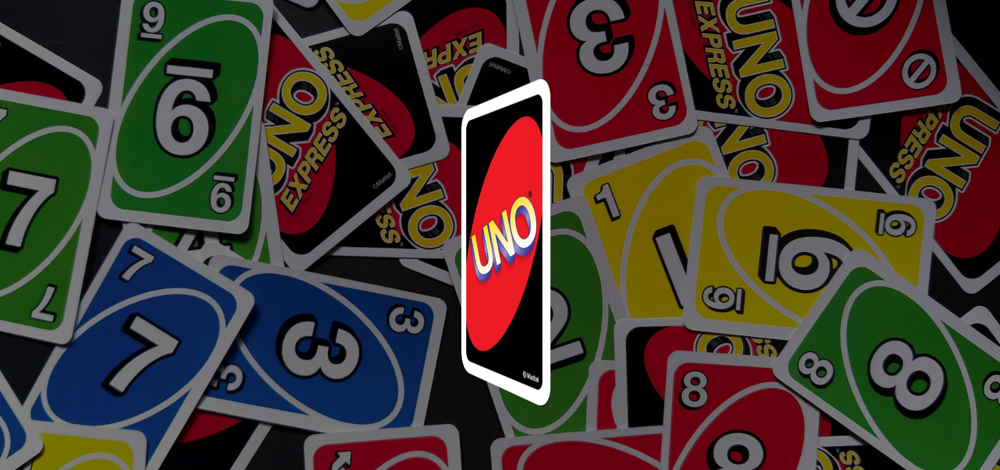

<h1 align="center"> Flip Card Uno </h1>

Programa apresentado como aula no Youtube no canal de Larissa Kich, onde se é possível ver uma animação de carta Uno que gira.</a>

  <a href="#-tecnologias">Tecnologias</a>&nbsp;&nbsp;&nbsp;|&nbsp;&nbsp;&nbsp;
  <a href="#-projeto">Projeto</a>&nbsp;&nbsp;&nbsp;|&nbsp;&nbsp;&nbsp;
  <a href="#-layout">Layout</a>&nbsp;&nbsp;&nbsp;|&nbsp;&nbsp;&nbsp;
  <a href="#memo-licença">Licença</a>

 

  

## 🚀 Tecnologias

Esse projeto foi desenvolvido com as seguintes tecnologias:

- HTML e CSS
- Javascript
- Git e Github

## 💻 Projeto

O Flip Card Uno é um programa que animação de carta Uno, utilizei para estudo de animações de imagens.

## 🔖 Layout

Você pode visualizar o projeto acessando o canal Larissa Kich no Youtube

## 📝 Licença

Livre

---

Feito com ♥ by Wellington Sato 👋